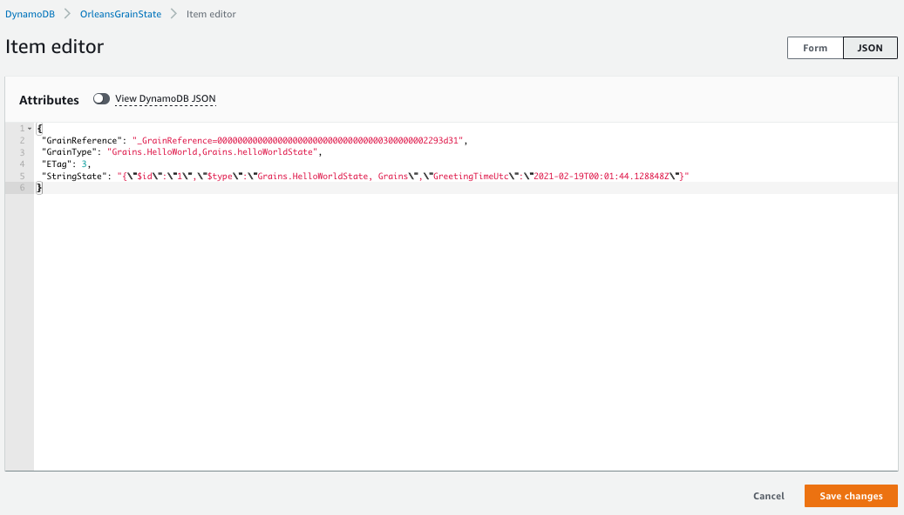
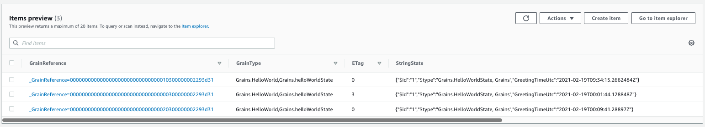

# readme

This example builds on top of Solution 3 by introducing `IPersistentState` to grains. The goal for this example is to demonstrate how to persist grain's state into a storage provider, in this case `DynamoDB`.

## how it works

* state is injected as `IPersistentState<HelloWorldState>` where `HelloWorldState` is a simple serializable POCO.
* state is not loaded at grain construction time, but before `OnActivateAsync` is called.
* `ISiloBuilder` is configured with DynamoDB `properties`. In my case, I have the following:
    * `AWS_SECRET_ACCESS_KEY`
    * `AWS_SESSION_TOKEN`
    * `AWS_ACCESS_KEY_ID`
    values set as my environment variables, so the silo configuration gets reduced to this:
      ```csharp
      siloBuilder.AddDynamoDBGrainStorage(
        name: "helloWorldStore",
        configureOptions: options =>
        {
            options.UseJson = true;
            options.Service = "us-west-2";
        });
      ```
* `AddDynamoDBGrainStorage` defaults the table to be `OrleansGrainState` if the value is not provided.

More on grain persistence here: https://dotnet.github.io/orleans/docs/grains/grain_persistence/index.html

## running the code

The code can be ran using the same type of scripts as the previous examples. Upon calling the grain, it greets the caller and displays the current time persisting it at the same to its state which in turn gets saved to `DynamoDB`.

Here is how the saved state looks like when saved from:

* grain identified by `0`:

  

  ```json
  {
    "GrainReference": "_GrainReference=000000000000000000000000000000000300000002293d31",
    "GrainType": "Grains.HelloWorld,Grains.helloWorldState",
    "ETag": 3,
    "StringState": "{\"$id\":\"1\",\"$type\":\"Grains.HelloWorldState, Grains\",\"GreetingTimeUtc\":\"2021-02-19T00:01:44.128848Z\"}"
  }
  ```

* grain identified by `1`:

  ```json
  {
   "GrainReference": "_GrainReference=000000000000000000000000000000010300000002293d31",
   "GrainType": "Grains.HelloWorld,Grains.helloWorldState",
   "ETag": 0,
   "StringState": "{\"$id\":\"1\",\"$type\":\"Grains.HelloWorldState, Grains\",\"GreetingTimeUtc\":\"2021-02-19T09:34:15.2662484Z\"}"
  }
  ```

* grain identified by `2`:

  ```json
  {
    "GrainReference": "_GrainReference=000000000000000000000000000000020300000002293d31",
    "GrainType": "Grains.HelloWorld,Grains.helloWorldState",
    "ETag": 0,
    "StringState": "{\"$id\":\"1\",\"$type\":\"Grains.HelloWorldState, Grains\",\"GreetingTimeUtc\":\"2021-02-19T00:09:41.28897Z\"}"
  }
  ```
  
I called three different grains from the client (grain ids 0, 1 and 2) and this is how my `DynamoDB` table looks like:

