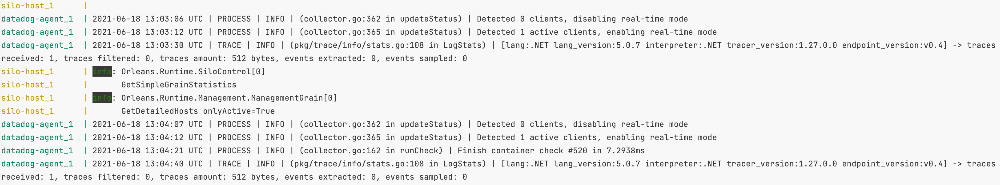
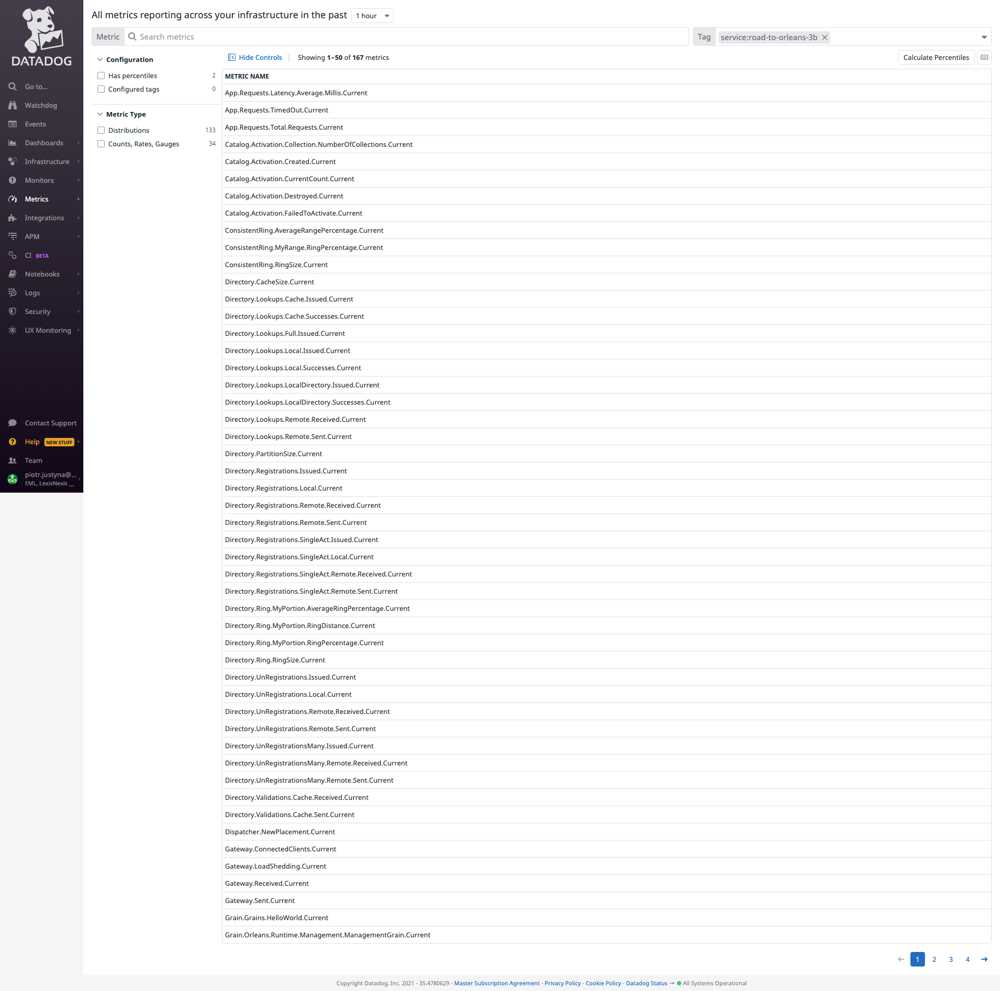
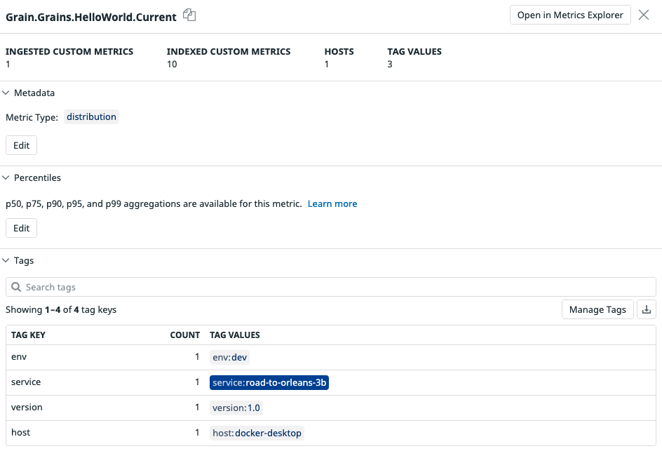
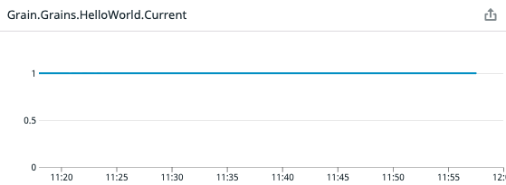
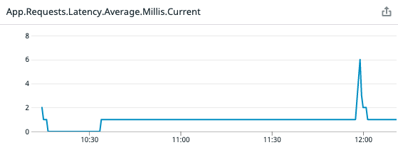
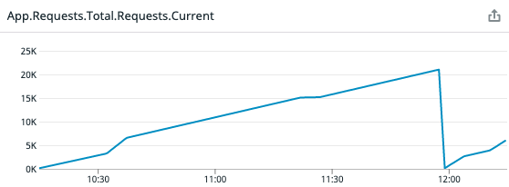
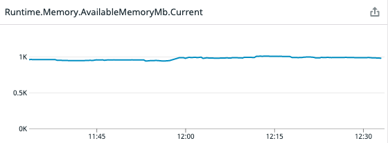
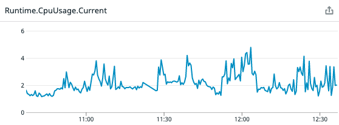
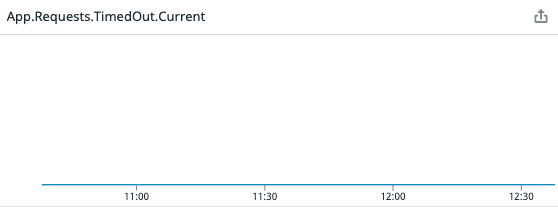

# readme

This example builds on top of Solution 3 by introducing datadog as an APM tool. The goal is to demonstrate how to:

* send orleans metrics to datadog
* implement `IMetricTelemetryConsumer` with datadog

## how it works

In addition to docker images defined in solution 3, we now have one more, which is hosting the datadog agent. The way datadog works is that it needs:

* tracer - this runs alongside the executable code it's supposed to monitor (in the same container)
* agent - this runs as a separate container alongside the container hosting your monitored application

We now have a [docker-compose.yml](./ops/SiloHost/docker-compose.yml) file which starts the datadog agent & silo host  duo.

## running the code

The easiest way to run the code is to execute:

* run-silo-docker.sh - this executes the [docker-compose.yml](./ops/SiloHost/docker-compose.yml) file and builds not only the silo host, but agent container propagating the data to datadog
  
* run-client-docker.sh - this starts the orleans client, no changes there

## metrics

There are 167 metrics the telemetry consumer exposes:

They are all correctly tagged:

Captured metrics help us formulate good understanding of what our orleans application is doing and what the resource consumption is. To list some of the most useful metrics:

|||
| --- | --- |
| `Grain.Grains.HelloWorld.Current` - number of `HelloWorld` grain. In our case it's an uneventful one grain.  | `App.Requests.Latency.Average.Millis.Current` - average application latency.  |
| `App.Requests.Total.Requests.Current` - total number of requests an application receives. In this example the application was restarted which reset the counter to 0.  | `Runtime.Memory.AvailableMemoryMb.Current` - amount of available memory in Mb.  |
| `Runtime.CpuUsage.Current` - amount of CPU the runtime consumes.  | `App.Requests.TimedOut.Current` - number of timed out requests. Uneventful zero.  |
