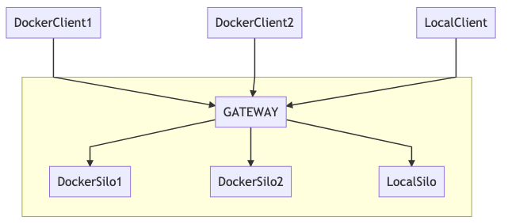

# readme
This example expands on example 3 and demonstrates how local, in-memory clustering works. It illustrates an easy to grasp local setup for engineers wanting to experiment with basic clustering properties of orleans on their local machines. A client/cluster of silos configuration is provided to enable communication between multiple clients and multiple silos. Those silos can in turn form a cluster and share grain activations based on cluster load generated by its clients.
As with previous examples, the configuration provided supports mixed hosting scenarios, so it is possible to have a cluster of silos hosted both:
* locally (outside docker)
* and in docker

and also a group of clients hosted the same way (inside and outside docker).

Main emphasis of this example is on grain activation sharing across silos forming a cluster. As clients generate cluster load, new activations of `HelloWorld` grains are created in individual silos forming the cluster. In-memory cluster membership is used by design and has its trade-offs:
* obviously the membership is not persisted anywhere, so a complete cluster failure cannot be recovered from (it is unlikely needed in a localhost scenario, though)
* gateway silo (aka the primary silo) is used by design to act as the primary point of contact for all clients (clients are not aware that there is more than one silo in the cluster) - that is mainly to illustrate the process of seamless sharing of grain activations between all silos forming the cluster.

It is not recommended to use setup like this in production as it makes the primary/gateway silo the main point of failure. If that silo goes down, the clients are not exposed to any other silos participating in the same cluster. A more mature approach (e.g. persistent membership table) is recommended in non-local environments.
## architecture

Each client (hosted locally or in docker) points at a gateway which in turn redistributes the requests to individual silos (hosted locally or in docker) if needed.

## running the code
### silos
As in example 3, following scripts can be used to run silos:
* `./run-docker-silo.sh`
* `./run-local-silo.sh`
Important thing to note is that if one wants to run multiple silos which form a cluster, following variables need to be made unique for every silo:
* `GATEWAYPORT` (e.g. `3001`, `3002`, etc.)
* `SILOPORT` (e.g. `2001`, `2002`, etc.)
* `DASHBOARDPORT` (e.g. `8081`, `8082`, etc.)
### clients
As in example 3, following scripts can be used to run clients:
* `./run-client-docker.sh`
* `./run-client-local.sh`
### demo
Alternatively, the following scripts can be ran to illustrate the rich array of various local/docker silo/client scenarios:
* run the cluster: `./run-demo-cluster.sh` (3 silos: 2 hosted in docker, 1 hosted locally)
* run the clients: `./run-demo-clients.sh` (6 clients: 5 hosted in docker, 1 hosted locally)
* stop the demo: `./stop-demo.sh` (stops all docker containers created during the demo)
