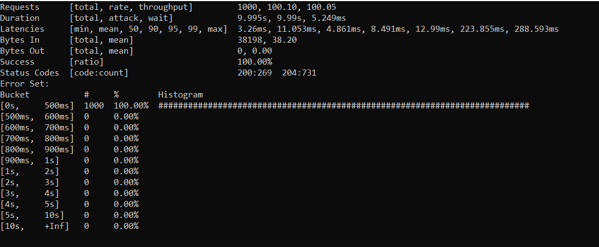

# readme

This example builds on top of solution 6 and demonstrates how to:

* control grains features using the [Feature Management Library](https://www.nuget.org/packages/Microsoft.FeatureManagement/)
* unit test grains using [OrleansTestKit](https://www.nuget.org/packages/OrleansTestKit/)
* do dependency injection in grains

## running the code

### silos

As in example 6, following scripts can be used to run silos:

* `./run-docker-silo.sh`
* `./run-local-silo.sh`

Important thing to note is that if one wants to run multiple silos which form a cluster, following variables need to be made unique for every silo:

* `GATEWAYPORT` (e.g. `3001`, `3002`, etc.)
* `SILOPORT` (e.g. `2001`, `2002`, etc.)
* `DASHBOARDPORT` (e.g. `8081`, `8082`, etc.)

### clients

As in example 6, following scripts can be used to run clients:

* `./run-client-docker.sh`
* `./run-client-local.sh`

### demo

Now we get to a bit more serious testing as it's easier to laod test the setup. Here is what's happening:

Load test results - vegeta. This image demonstartes the resuse of grains (50 max grains for HelloWorld)
and feature managment in action, feature enabled - status code 200, feature disabled - status code 204:

Load test results - orleans dashboard:

#### running the demo

* run the cluster: `./run-demo-cluster.sh` (3 silos: 2 hosted in docker, 1 hosted locally)
* run the client: `./run-demo-client.sh` (only one client needed in this case, vegeta is going to do the heavy lifting)
* run the load test: `./run-demo-load-test.sh` (vegeta script generating 100 requests per second of constant load)