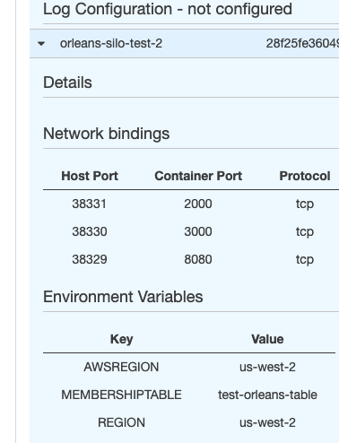
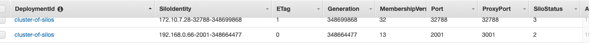
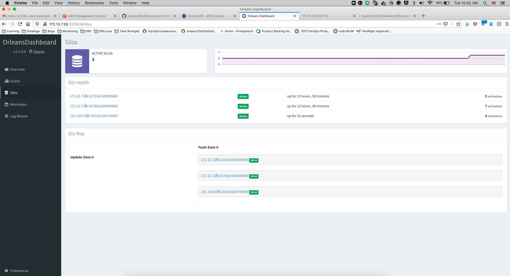

# readme

This example is somewhat different to previous examples as it's hosted in ECS.
* A membership table is created in Dynamo db, this eliminates the need for a Primary Silo endpoint as endpoint details are stored in dynamo. 
It also means that the client only needs the dynamo connection info to find all available silos.
* Extension methods have also been created for building silos to abstract setup.
* A CloudFormation template has also been provided to instantiate the sample in AWS.
* Demonstrations of local instances connecting to cloud based clusters are also included.

## running the code
### ECS
* To pull this code in CloudFormation, it'll be necessary to store your github user and authentication token in the aws secrets manager
 so the image can be pulled from git container registry. Then point at the secret in the cloud formation template, 
 below is a sample of how the secret should be stored.

`{
  "username" : "mrblonde91",
  "password" : "token"
}`
* Run the template to pull the image and it will start creating the containers.

* Internally the ports are defaulted and externally an available one is selected.

* A sample of the dynamo data is displayed above, the cluster id acts as a unique identifier for each cluster. So multiple clusters can be stored 
in the same table if the user wishes. Clusters can also contain different versions of silos eg for testing purposes.
### Running Silo local -> Aws Cluster

* Authenticate with aws in your terminal and make sure your environment variables are set. As in example 7, the following scripts can be used to run silos locally:

* `./run-docker-silo.sh`
* `./run-local-silo.sh`

The following variables need to be set to allow for a connection to the dynamo db.
* `MEMBERSHIPTABLE` set to name of membership table eg "OrleansMembership"
* `AWSREGION` set to ecs region eg "us-west-2"
Important thing to note is that if one wants to run multiple silos which form a cluster, the following variables need to be made unique for every local silo:

* `GATEWAYPORT` (e.g. `3001`, `3002`, etc.)
* `SILOPORT` (e.g. `2001`, `2002`, etc.)
* `DASHBOARDPORT` (e.g. `8081`, `8082`, etc.)

* As you can see, the local client has connected to the cluster so it's perfectly for silos to be based in multiple locations and relatively easy to implement.
### clients
* Authenticate with aws in your terminal. 

As in example 7, following scripts can be used to run clients:

* `./run-client-docker.sh`
* `./run-client-local.sh`

The following variables need to be set to allow for a connection to the dynamo db.
* `MEMBERSHIPTABLE` set to name of membership table eg "OrleansMembership"
* `AWSREGION` set to ecs region eg "us-west"

* When requests are made, they get distributed to one of the silos from the cluster which can be either the local or cloud instance.
#### running the demo

* run the cluster: `./run-demo-cluster.sh` (3 silos: 2 hosted in docker, 1 hosted locally), if joining ECS instance, this will increase overall number to 5
* run the client: `./run-demo-client.sh` 