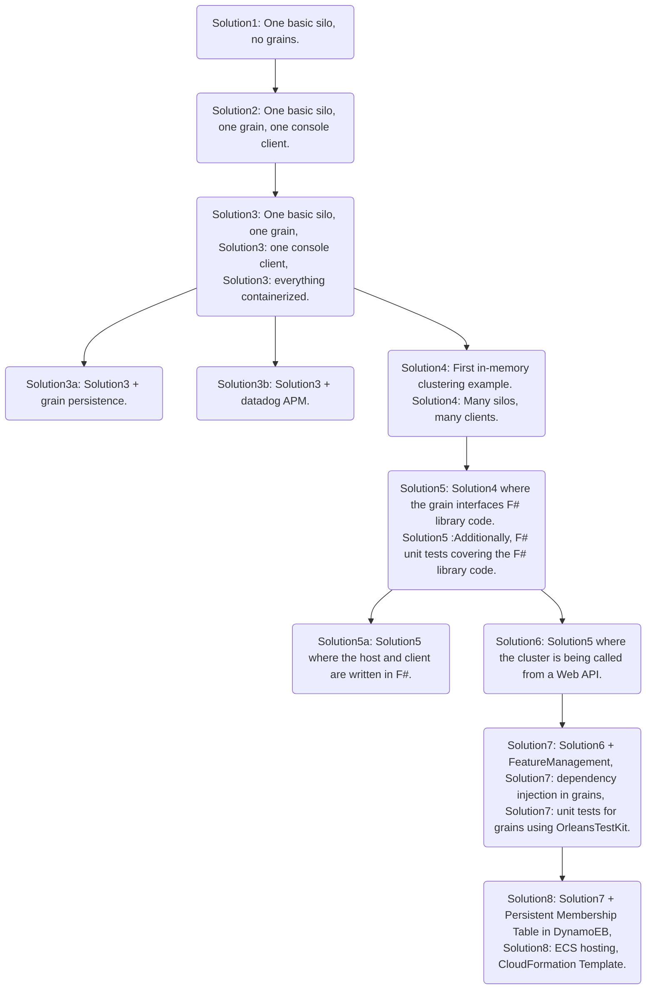

- [road to orleans](#road-to-orleans)
  - [build & run](#build--run)
  - [monitoring](#monitoring)
  - [code](#code)
  - [further reading](#further-reading)

# road to orleans

This repository illustrates the road to orleans with practical, real-life examples as .NET solutions. From most basic, to more advanced techniques. The code is written using .NET 5 and was tested on MacOS (Catalina 10.15.7) and, wherever docker is supported, Linux (Alpine 3.12).

## build & run

- IDE: build + run (first the cluster, then the client)
- `run-[client/silo]-[docker/local].sh`

## monitoring

Silo dashboards are available by default on `localhost:8080` unless configured otherwise in the code/`dockerfile`/`run-[client/silo]-[docker/local].sh`. Additionally, Datadog APM support is illustrated in solution 3b.

## code

| solution                   | description                                                                                                                                                                                                                 | docker support     | clustering | clustered silos | grains                                  | clients     | \*visual studio code support | \*remote containers support |
| -------------------------- | --------------------------------------------------------------------------------------------------------------------------------------------------------------------------------------------------------------------------- | ------------------ | ---------- | --------------- | --------------------------------------- | ----------- | ---------------------------- | --------------------------- |
| [solution1](1/readme.md)   | One basic silo, no grains.                                                                                                                                                                                                  | :white_check_mark: | -          | 1               | 0                                       | 0           | :white_check_mark:           | :white_check_mark:          |
| [solution2](2/readme.md)   | One basic silo, one grain, one console client.                                                                                                                                                                              | -                  | -          | 1               | 1 C# grain                              | 1 - console | :white_check_mark:           | :white_check_mark:          |
| [solution3](3/readme.md)   | One basic silo, one grain, one console client, everything containerized.                                                                                                                                                    | :white_check_mark: | -          | 1               | 1 C# grain                              | 1 - console | :white_check_mark:           | :white_check_mark:          |
| [solution3a](3a/readme.md) | Solution3 + grain persistence.                                                                                                                                                                                              | :white_check_mark: | -          | 1               | 1 C# grain                              | 1 - console | :white_check_mark:           | :white_check_mark:          |
| [solution3b](3b/readme.md) | Solution3 + datadog APM.                                                                                                                                                                                                    | :white_check_mark: | -          | 1               | 1 C# grain                              | 1 - console | :white_check_mark:           | :white_check_mark:          |
| [solution4](4/readme.md)   | First in-memory clustering example. Many silos, many clients.                                                                                                                                                               | :white_check_mark: | in-memory  | n               | 1 C# grain                              | n - console | :white_check_mark:           | :white_check_mark:          |
| [solution5](5/readme.md)   | Solution4 where the grain interfaces F# library code. Additionally, F# unit tests covering the F# library code.                                                                                                             | :white_check_mark: | in-memory  | n               | 1 C# grain interfacing F# library code. | n - console |                              | :white_check_mark:          |
| [solution5a](5a/readme.md) | Solution5 where the host and client are written in F#.                                                                                                                                                                      | :white_check_mark: | in-memory  | n               | 1 F# grain interfacing F# library code. | n - console |                              | :white_check_mark:          |
| [solution6](6/readme.md)   | Solution5 where the cluster is being called from a Web API.                                                                                                                                                                 | :white_check_mark: | in-memory  | n               | 1 C# grain interfacing F# library code  | n - web api |                              | :white_check_mark:          |
| [solution7](7/readme.md)   | Solution6 + [FeatureManagement](https://www.nuget.org/packages/Microsoft.FeatureManagement/), dependency injection in grains, unit tests for grains using [OrleansTestKit](https://www.nuget.org/packages/OrleansTestKit/). | :white_check_mark: | in-memory  | n               | 1 C# grain interfacing F# library code  | n - web api |                              | :white_check_mark:          |
| [solution8](8/readme.md)   | Solution7 + Persistent Membership Table in DynamoEB, ECS hosting, CloudFormation Template.                                                                                                                                  | :white_check_mark: | Dynamo     | n               | 1 C# grain interfacing F# library code  | n - web api |                              | :white_check_mark:          |

\*visual studio code support:

- `[ctrl/cmd]+shift+b`: builds selected projects
- `f5`: runs selected projects

\*remote containers support: ability to develop/build/run/debug code inside [containers](https://code.visualstudio.com/docs/remote/containers). This is to support those who just want to quickly pull the repository code and experiment with it with e.g. Visual Studio Code. Code + batteries included.

## further reading

- https://gitter.im/road-to-orleans/community - road to orleans gitter
- https://github.com/dotnet/orleans - orleans repository
- https://dotnet.github.io/orleans/ - orleans documentation
- https://www.microsoft.com/en-us/research/wp-content/uploads/2016/02/Orleans20Best20Practices.pdf - orleans best practices
- https://gitter.im/dotnet/orleans/ - orleans gitter
- https://www.microsoft.com/en-us/research/wp-content/uploads/2016/02/Orleans-MSR-TR-2014-41.pdf - virtual actors paper
- https://github.com/OrleansContrib - orbiting repositories (e.g. orleans dashboard)
- https://github.com/PiotrJustyna/FeatureManagementSandbox - more involved use cases for [FeatureManagement](https://www.nuget.org/packages/Microsoft.FeatureManagement/)

## to watch

- https://youtu.be/GKXiGhFBd90 - observability: logs, tracing, metrics
- https://youtu.be/R0ODfwU6MzQ - orleans: deep dive
